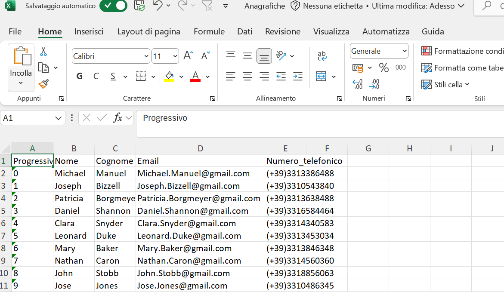
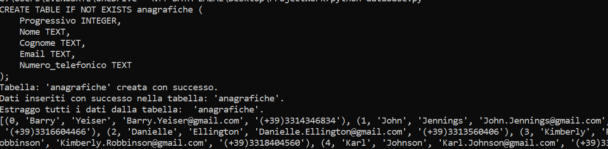

# Project Work traccia 2.1 - Ruolo della privacy e sull'importanza del GDPR - Raffaele Venuso
## Languages
- Python
<br>

## Components (in Project)
- pandas
- sqllite3
- xlsxwriter
- names
<br>

## Installation
Install the following libraries (`ctrl + shift + x` or `cmd + shift + x` on mac).
```
$ pip install names
```

```
$ pip install sqllite3
```

```
$ pip install pandas
```

```
$ pip install xlswriter
```

## Instruction
- Launch the file `ProjectWork/excel.py`, it will create an Excel file called "**Anagrafiche.xlsx**" containing the personal data generated randomly:
  

- Launch the file `ProjectWork/database.py`, a database will be created (`ProjectWork/project_work.db`) with a table having the same structure of the excel file, also it will make an insertion query starting from the excel file:
  
  
